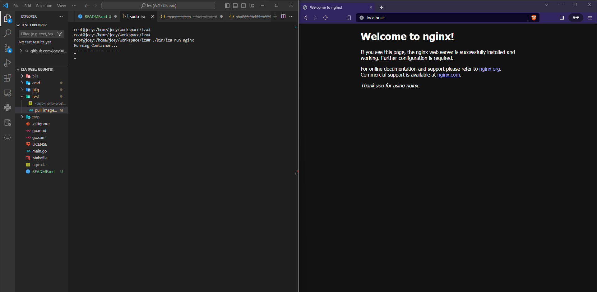
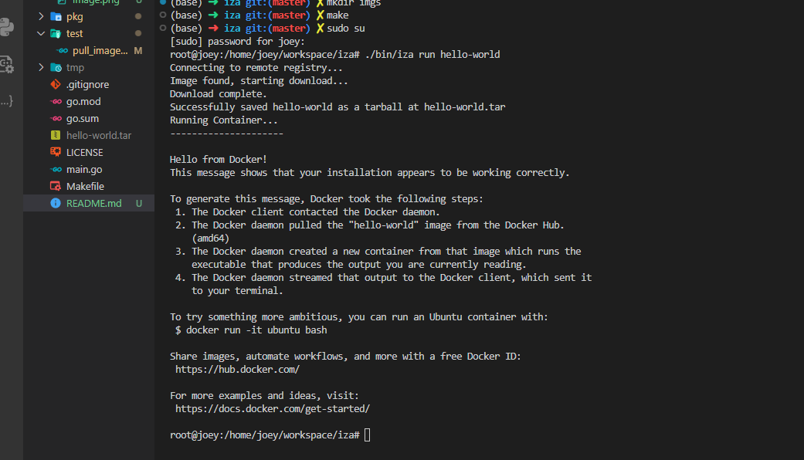

# IZA 

iza is tiny container runtime (like Docker)

```bash

root@joey:/home/joey/workspace/iza# ./bin/iza run alpine /bin/sh
Running Container...
---------------------
/ # cat /etc/os-release  | grep NAME=
NAME="Alpine Linux"
PRETTY_NAME="Alpine Linux v3.19"
/ # 

```

## 
I was learning how conatiner works, Turn outs its just chroot and syscalls <br>


<br>
<br>

although this is tiny and not OCI compilent,it's still pretty powerfull <br>

you can run nginx with 

 (no port mapping required using host network)

### Build

```bash

make all
## run

./bin/iza run hello-wrold
```
<br><br>
 


## Contribution guidelines
- be nice
- raise pr with explanatory title


<br><br>

### How this works
All This is just chroot and syscall for isolation, that why container run so efficently<br>
Initially I thought I will write blog on it but there two wonder full talk that are good enough to anyone to understand
- [Build your own Container Runtime with chroot by Adam Gordon Bell](https://youtu.be/89ESCBzM-3Q?si=L54v9jYto76LFX35)
- [Containers From Scratch • Liz Rice](https://youtu.be/8fi7uSYlOdc?si=3S4v-JzX6swgpjjz) 

#### Name? 
I am reading turtles all the way down main character in book has nickname aza, I miss speed it while creating project iza
